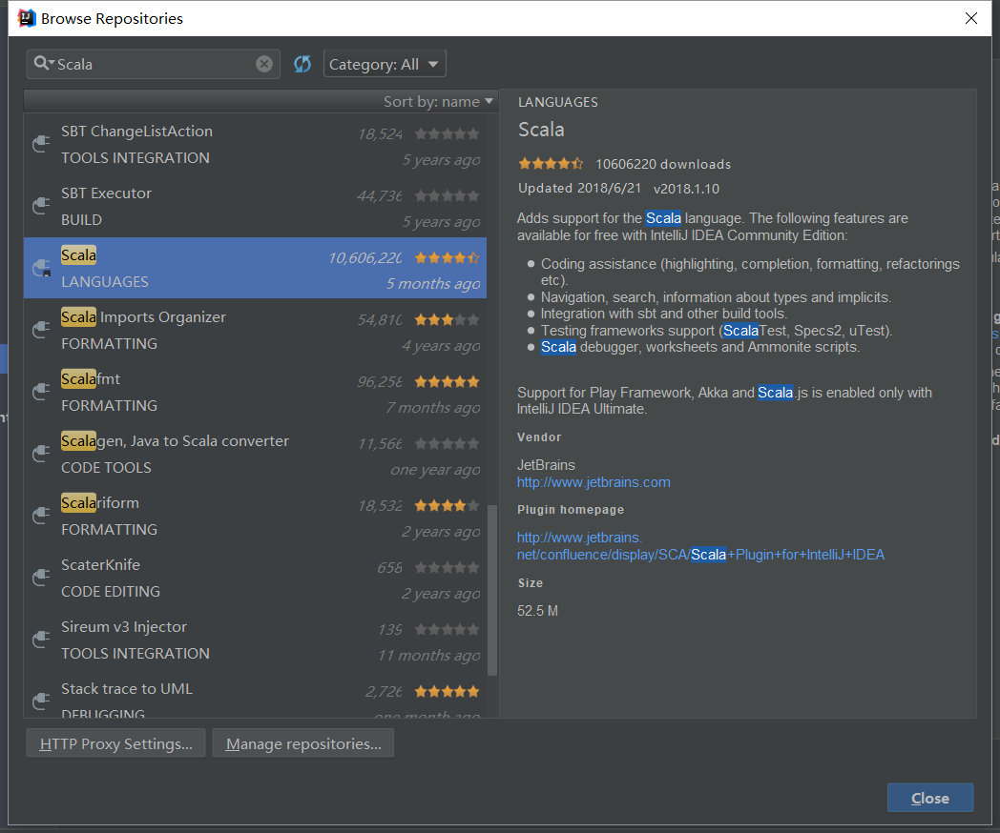

# Run PageRank.scala in Windows System(IntelliJ)
<p align="right">Written by Tianyi</p>
##1. install scala in your Window OS
Follow the link to install https://www.scala-lang.org/download/
##2. install scalar plugin in IntelliJ
In File -> Settings -> Plugins click Browse repositories, then search "Scala" and install.

##3. Create a new project with Maven
Create a Maven project and import three repositories in poem.xml
```Maven
<dependency>
    <groupId>org.apache.spark</groupId>
    <artifactId>spark-graphx_2.12</artifactId>
    <version>2.4.0</version>
</dependency>
<dependency>
    <groupId>com.thoughtworks.paranamer</groupId>
    <artifactId>paranamer</artifactId>
    <version>2.8</version>
</dependency>
<!-- https://mvnrepository.com/artifact/org.apache.spark/spark-sql -->
<dependency>
    <groupId>org.apache.spark</groupId>
    <artifactId>spark-sql_2.12</artifactId>
    <version>2.4.0</version>
</dependency>
```
##4.Run PageRank.scala in IDEA
You need to modify location info in the code with your own computer direction. And also you need to set a new variable as config for Spark.
```scala
val conf = new SparkConf().setAppName("PageRank").setMaster("local[4]")
```
Then assign this config when initialization SparkSession, like the code below.
```scala
val spark = SparkSession
  .builder
  .appName(s"${this.getClass.getSimpleName}")
  .config(conf)
  .getOrCreate()
```
